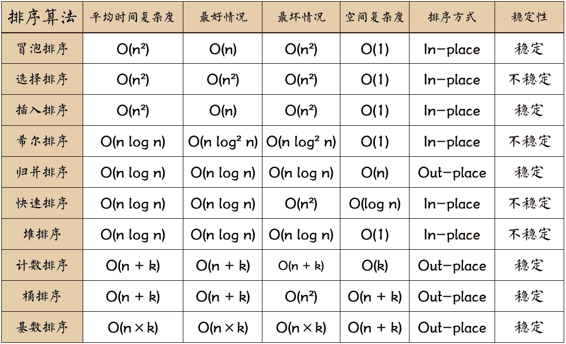

# Sort

<div align="center">

</div>

## heapsort
最大堆 是一个数组，可以看成一个近似的完全二叉树，树中其父节点值大于子节点。
```
# 在调用max_heapify时，我们假定根节点为left(i), right(i)的二叉树都是最大堆
# 执行max_heapify后，以i为根节点的子树为最大堆
def max_heapify(A, i):
    """O(lg n)"""
    l = i * 2 + 1
    r = i * 2 + 2
    if l <= len(A) and A[l] > A[i]:
        largest = l 
    else:
        largest = i
    if r <= len(A) and A[r] > A[largest]:
        largest = r
    if largest != i:
        A[i], A[largest] = A[largest], A[i]
        max_heapify(A, largest)

def build_max_heap(A):
    """O(n)"""
    for i in range(len(A)//2, -1, -1):
        max_heapify(A, i)

def heapsort(A):
    build_max_heap(A)
    ans = []
    for i in range(len(A)-1, 0, -1):
        A[0], A[i] = A[i], A[0]
        ans.append(A.pop())
        max_heapify(A, 0)
    return ans
```

## quicksort

见`quicksort.py`

## mergesort 

见`mergesort.py`
