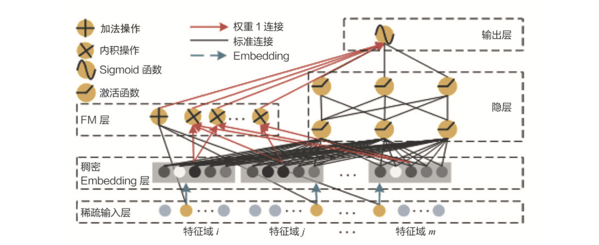
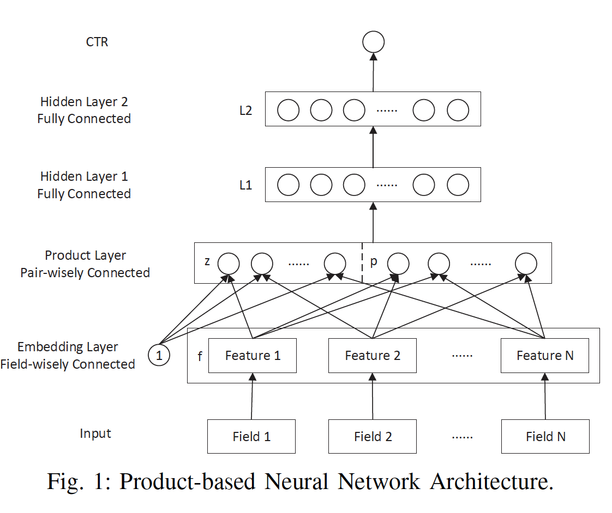
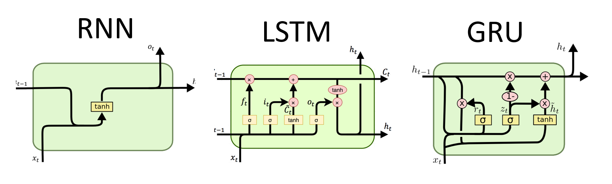
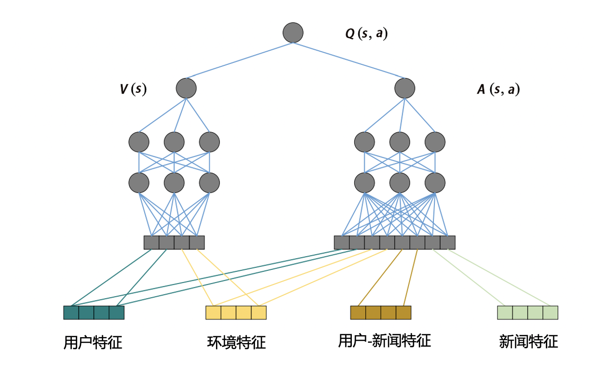
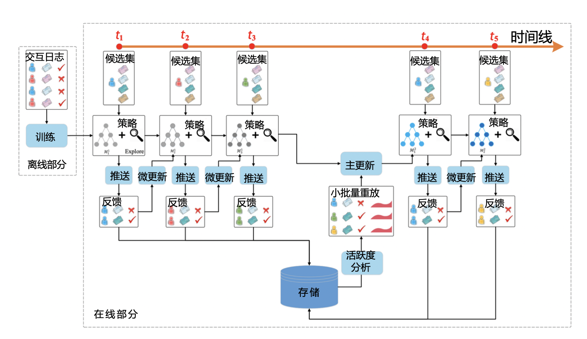
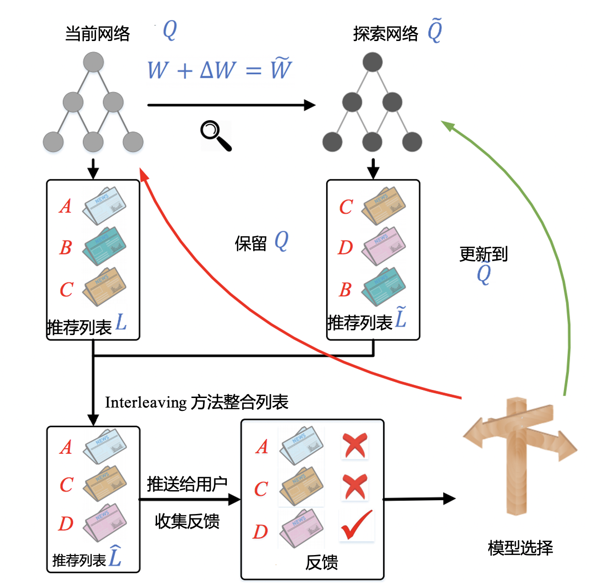

# Deep Recommendation Network

## Wide&Deep

Wide&Deep 模型的结构图了，它是由左侧的 Wide 部分和右侧的 Deep 部分组成的。Wide 部分就是把输入层直接连接到输出层，中间没有做任何处理。Deep 层为 Embedding+MLP 的模型结构。那 Google 为什么要创造这样一个混合式的模型结构呢？简单来说，Wide 部分的主要作用是让模型具有较强的“记忆能力”（Memorization），而 Deep 部分的主要作用是让模型具有“泛化能力”（Generalization），因为只有这样的结构特点，才能让模型兼具逻辑回归和深度神经网络的优点，也就是既能快速处理和记忆大量历史行为特征，又具有强大的表达能力。

所谓的 “记忆能力”，可以被宽泛地理解为模型直接学习历史数据中物品或者特征的“共现频率”，并且把它们直接作为推荐依据的能力。Wide 部分可以增强模型的记忆能力，让模型记住大量的直接且重要的规则，这正是单层的线性模型所擅长的。

泛化能力”指的是模型对于新鲜样本、以及从未出现过的特征组合的预测能力。

在 Deep 部分和 Wide 部分都构建完后，我们要使用 concatenate layer 把两部分连接起来，形成一个完整的特征向量，输入到最终的 sigmoid 神经元中，产生推荐分数。

## NeuralCF

协同过滤是通过直接利用非常稀疏的共现矩阵进行预测的，所以模型的泛化能力非常弱，遇到历史行为非常少的用户，就没法产生准确的推荐结果了。可以通过矩阵分解算法增强它的泛化能力，但因为矩阵分解是利用非常简单的内积方式来处理用户向量和物品向量的交叉问题的，所以，它的拟合能力也比较弱。-> **利用深度学习来改进协同过滤算法。**

把矩阵分解神经网络化之后，把它跟 Embedding+MLP 以及 Wide&Deep 模型做对比，我们可以一眼看出网络中的薄弱环节：矩阵分解在 Embedding 层之上的操作好像过于简单了，就是直接利用内积得出最终结果。这会导致特征之间还没有充分交叉就直接输出结果，模型会有欠拟合的风险。针对这一弱点，NeuralCF 对矩阵分解进行了改进，它的结构图如下：

NeuralCF 用一个多层的神经网络替代掉了原来简单的点积操作。这样就可以让用户和物品隐向量之间进行充分的交叉，提高模型整体的拟合能力。

事实上，NeuralCF 的模型结构之中，蕴含了一个非常有价值的思想，就是我们可以把模型分成用户侧模型和物品侧模型两部分，然后用互操作层把这两部分联合起来，产生最后的预测得分。这里的用户侧模型结构和物品侧模型结构，可以是简单的 Embedding 层，也可以是复杂的神经网络结构，最后的互操作层可以是简单的点积操作，也可以是比较复杂的 MLP 结构。但只要是这种物品侧模型 + 用户侧模型 + 互操作层的模型结构，我们把它统称为**双塔模型**结构。

这个双塔模型相比我们之前学过的 Embedding MLP 和 Wide&Deep 有什么优势呢？其实在实际工作中，双塔模型最重要的优势就在于它易上线、易服务。物品塔和用户塔最顶端的那层神经元，那层神经元的输出其实就是一个全新的物品 Embedding 和用户 Embedding。物品塔的输入特征向量是 x，经过物品塔的一系列变换，生成了向量 u(x)，那么这个 u(x) 就是这个物品的 Embedding 向量。同理，v(y) 是用户 y 的 Embedding 向量，这时，我们就可以把 u(x) 和 v(y) 存入特征数据库，这样一来，线上服务的时候，我们只要把 u(x) 和 v(y) 取出来，再对它们做简单的互操作层运算就可以得出最后的模型预估结果了！所以使用双塔模型，我们不用把整个模型都部署上线，只需要预存物品塔和用户塔的输出，以及在线上实现互操作层就可以了。如果这个互操作层是点积操作，那么这个实现可以说没有任何难度，这是实际应用中非常容易落地的。

## DeepFM

Embedding MLP 和 Wide&Deep 模型都没有针对性的处理特征交叉问题。

说到解决特征交叉问题的传统机器学习模型，不得不提一下模型因子分解机模型（Factorization Machine），即 FM。

图中模型的最下面，它的输入是由类别型特征转换成的 One-hot 向量，把 One-hot 特征通过 Embedding 层转换成稠密 Embedding 向量。到这里，FM 跟其他深度学习模型其实并没有区别，但再往上区别就明显了。FM 会使用一个独特的层 FM Layer 来专门处理特征之间的交叉问题。你可以看到，FM 层中有多个内积操作单元对不同特征向量进行两两组合，这些操作单元会把不同特征的内积操作的结果输入最后的输出神经元，以此来完成最后的预测。

DeepFM 利用了 Wide&Deep 组合模型的思想，用 FM 替换了 Wide&Deep 左边的 Wide 部分，加强了浅层网络部分特征组合的能力，而右边的部分跟 Wide&Deep 的 Deep 部分一样，主要利用多层神经网络进行所有特征的深层处理，最后的输出层是把 FM 部分的输出和 Deep 部分的输出综合起来，产生最后的预估结果。

### 元素积操作

FM 和 DeepFM 中进行特征交叉的方式，都是进行 Embedding 向量的点积操作，那是不是说特征交叉就只能用点积操作了？答案当然是否定的。事实上还有很多向量间的运算方式可以进行特征的交叉，比如模型 NFM（Neural Factorization Machines），就使用了新的特征交叉方法。

Bi-Interaction Pooling Layer 中特征交叉方法为两个向量的元素积（Element-wise Product）操作，即两个长度相同的向量对应维相乘得到元素积向量。

在进行两两特征 Embedding 向量的元素积操作后，再求取所有交叉特征向量之和，我们就得到了池化层的输出向量。

总的来说，NFM 并没有使用内积操作来进行特征 Embedding 向量的交叉，而是使用元素积的操作。在得到交叉特征向量之后，也没有使用 concatenate 操作把它们连接起来，而是采用了求和的池化操作，把它们叠加起来。

## PNN 
use product layers to explore feature interactions
automatically.

- IPNN: innner product
- OPNN: outer product

## DIN

下图就是 DIN 的基础模型 Base Model。我们可以看到，Base Model 是一个典型的 Embedding MLP 的结构。

用户行为特征是由一系列用户购买过的商品组成的，也就是图上的 Goods 1 到 Goods N，而每个商品又包含了三个子特征，也就是图中的三个彩色点，其中红色代表商品 ID，蓝色是商铺 ID，粉色是商品类别 ID。同时，候选广告特征也包含了这三个 ID 型的子特征，因为这里的候选广告也是一个阿里平台上的商品。

因为用户的行为序列其实是一组商品的序列，这个序列可长可短，但是神经网络的输入向量的维度必须是固定的，那我们应该怎么把这一组商品的 Embedding 处理成一个长度固定的 Embedding 呢？图中的 SUM Pooling 层的结构就给出了答案，就是直接把这些商品的 Embedding 叠加起来，然后再把叠加后的 Embedding 跟其他所有特征的连接结果输入 MLP。

但这个时候问题又来了，SUM Pooling 的 Embedding 叠加操作其实是把所有历史行为一视同仁，没有任何重点地加起来，这其实并不符合我们购物的习惯。

从下面的 DIN 模型架构图中看到，与 Base Model 相比，DIN 为每个用户的历史购买商品加上了一个激活单元（Activation Unit），这个激活单元生成了一个权重，这个权重就是用户对这个历史商品的注意力得分，权重的大小对应用户注意力的高低。

那现在问题就只剩下一个了，这个所谓的激活单元，到底是怎么计算出最后的注意力权重的呢？激活单元的输入是当前这个历史行为商品的 Embedding，以及候选广告商品的 Embedding。我们把这两个输入 Embedding，与它们的外积结果连接起来形成一个向量，再输入给激活单元的 MLP 层，最终会生成一个注意力权重，这就是激活单元的结构。简单来说，激活单元就相当于一个小的深度学习模型，它利用两个商品的 Embedding，生成了代表它们关联程度的注意力权重。

### DIEN

特定用户的历史行为都是一个随时间排序的序列。既然是和时间相关的序列，就一定存在前后行为的依赖关系，这样的序列信息对于推荐过程是非常有价值的。DIEN 模型正好弥补了 DIN 模型没有对行为序列进行建模的缺陷，它围绕兴趣进化这个点进一步对 DIN 模型做了改进。

与 DIN 不同的是，DIEN 用“兴趣进化网络”也就是图中的彩色部分替换掉了原来带有激活单元的用户历史行为部分。这部分虽然复杂，但它的输出只是一个 h'(T) 的 Embedding 向量，它代表了用户当前的兴趣向量。有了这个兴趣向量之后，再把它与其他特征连接在一起，DIEN 就能通过 MLP 作出最后的预测了。

1. 最下面一层是行为序列层（Behavior Layer，浅绿色部分）。它的主要作用和一个普通的 Embedding 层是一样的，负责把原始的 ID 类行为序列转换成 Embedding 行为序列。
2. 再上一层是兴趣抽取层（Interest Extractor Layer，浅黄色部分）。它的主要作用是利用 GRU 组成的序列模型，来模拟用户兴趣迁移过程，抽取出每个商品节点对应的用户兴趣。
3. 最上面一层是兴趣进化层（Interest Evolving Layer，浅红色部分）。它的主要作用是利用 AUGRU(GRU with Attention Update Gate) 组成的序列模型，在兴趣抽取层基础上加入注意力机制，模拟与当前目标广告（Target Ad）相关的兴趣进化过程，兴趣进化层的最后一个状态的输出就是用户当前的兴趣向量 h'(T)。

附：一些常用的序列模型结构

## DRN

DRN的q网络结构如图：

在强化学习的框架下，用户塔特征向量因为代表了用户当前所处的状态，所以也可被视为状态向量。物品塔特征向量则代表了系统下一步要选择的新闻，我们刚才说了，这个选择新闻的过程就是智能体的“行动”，所以物品塔特征向量也被称为行动向量。双塔模型通过对状态向量和行动向量分别进行 MLP 处理，再用互操作层生成了最终的行动质量得分 Q(s,a)，智能体正是通过这一得分的高低，来选择到底做出哪些行动，也就是推荐哪些新闻给用户的。

离线部分。DRN 根据历史数据训练好 DQN 模型，作为智能体的初始化模型。而在线部分根据模型更新的间隔分成 n 个时间段，这里以 t1 到 t5 时间段为例。首先在 t1 到 t2 阶段，DRN 利用初始化模型进行一段时间的推送服务，积累反馈数据。接着是在 t2 时间点，DRN 利用 t1 到 t2 阶段积累的用户点击数据，进行模型微更新（Minor update）。最后在 t4 时间点，DRN 利用 t1 到 t4 阶段的用户点击数据及用户活跃度数据，进行模型的主更新（Major update）。时间线不断延长，我们就不断重复 t1 到 t4 这 3 个阶段的操作。

DRN 使用的一种新的在线训练方法，Dueling Bandit Gradient Descent algorithm（竞争梯度下降算法）。

DRN 的在线学习过程主要包括三步:
1. 对于已经训练好的当前网络 Q，对其模型参数 W 添加一个较小的随机扰动，得到一个新的模型参数，这里我们称对应的网络为探索网络 Q~。在这一步中，由当前网络 Q 生成探索网络 ，产生随机扰动的公式：
$ΔW=α⋅rand(−1,1)⋅W$
其中，α 是一个探索因子，决定探索力度的大小。rand(-1,1) 产生的是一个[-1,1]之间的随机数。
2. 对于当前网络 Q 和探索网络 Q~，分别生成推荐列表 L 和 L~，再将两个推荐列表用间隔穿插（Interleaving）的方式融合，组合成一个推荐列表后推送给用户。
3. 实时收集用户反馈。如果探索网络 Q～生成内容的效果好于当前网络 Q，我们就用探索网络代替当前网络，进入下一轮迭代。反之，我们就保留当前网络。

