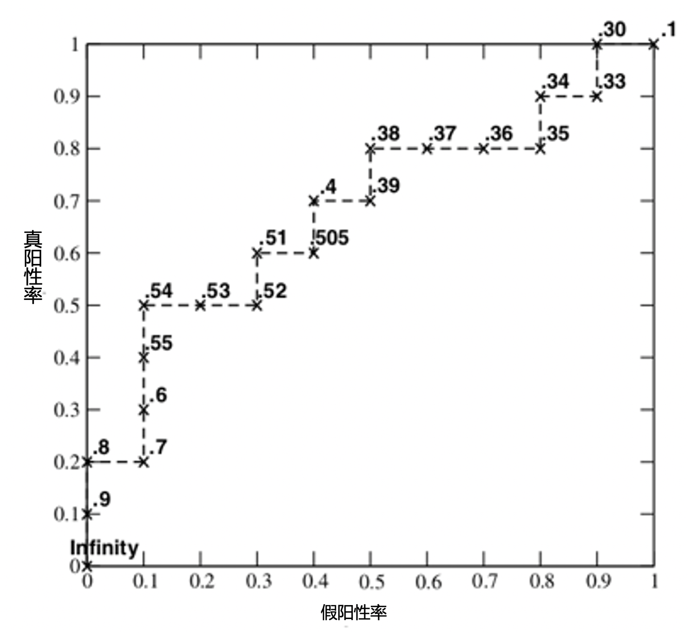
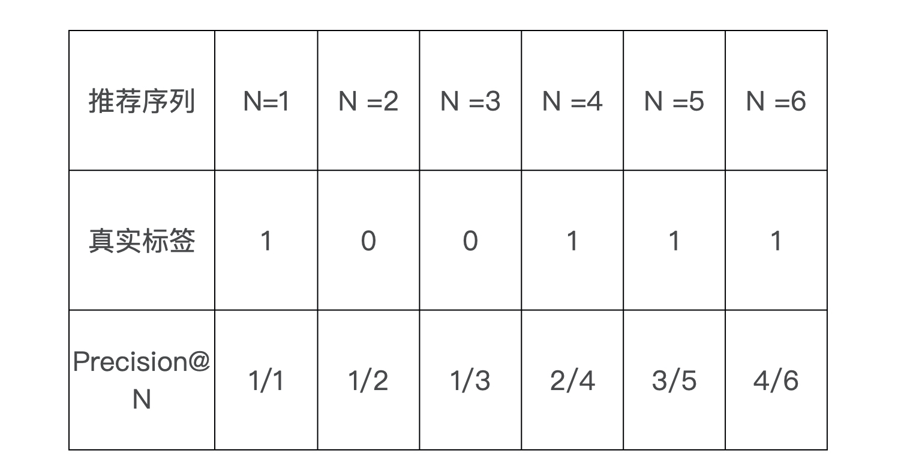

# 常用评测指标

1. 准确率 Accuracy
2. 精确率与召回率 Precision & Recall
3. 对数损失
4. 均方根误差 RMSE
5. P-R 曲线
6. ROC 
7. MAP
8. NDCG
9. PCOPC
10. GAUC

## Precision & Recall
精确率（Precision）指的是分类正确的正样本个数占分类器判定为正样本个数的比例，召回率（Recall）是分类正确的正样本个数占真正的正样本个数的比例。

在推荐列表中，通常没有一个确定的阈值来把预测结果直接判定为正样本或负样本，而是采用 Top N 排序结果的精确率（Precision@N）和召回率（Recall@N）来衡量排序模型的性能。具体操作，就是认为模型排序的前 N 个结果就是模型判定的正样本，然后分别计算 Precision@N 和 Recall@N。

**F1-score** 的定义是精确率和召回率的调和平均值:
$$F1= \frac {2⋅ precision ⋅ recall}{precision + recall} ​$$

## P-R 曲线
P-R 曲线的横轴是召回率，纵轴是精确率。对于一个推荐模型来说，它的 P-R 曲线上的一个点代表“在某一阈值下，模型将大于该阈值的结果判定为正样本，将小于该阈值的结果判定为负样本时，整体结果对应的召回率和精确率”。整条 P-R 曲线是通过从高到低移动正样本阈值生成的。
P-R 曲线总归是一条曲线，不是一个数字，我们很难用它直接来判断模型的好坏。AUC(Area Under Curve)，曲线下面积。指的是 P-R 曲线下的面积大小，因此计算 AUC 值只需要沿着 P-R 曲线横轴做积分。AUC 越大，就证明推荐模型的性能越好。

## ROC
ROC 曲线的横坐标是 False Positive Rate（FPR，假阳性率），纵坐标是 True Positive Rate （TPR，真阳性率）。
$$FPR = \frac{FP}{N}, TPR = \frac{TP}{P} $$
P 指的是真实的正样本数量，N 是真实的负样本数量；TP 指的是 P 个正样本中被分类器预测为正样本的个数，FP 指的是 N 个负样本中被分类器预测为正样本的个数。

和 P-R 曲线一样，ROC 曲线也是通过不断移动模型正样本阈值生成的。

当正负样本的分布发生变化时，ROC曲线的形状能基本保持不变，而P-R曲线形状一般会发生剧烈变化。因此ROC曲线适用的场景更多。

AUC计算：
$$ AUC = 1 - \frac{\sum_{i \in Pos}rank_i - M(1+M)/2}{M*N}$$
其中，M表示正样本数量，N表示负样本数量。分子表示负样本得分高于正样本的组合数，分母表示所有组合数。

## GAUC

GAUC is a weighted average of AUC calculated in the subset of samples group by the user. The weight can be impressions or clicks. An impression based GAUC is calculated as follows:

$$ GAUC = \frac{\sum_i^n w_i AUC_i}{\sum_i^n w_i} = \frac{\sum_i^n impression_i AUC_i}{\sum_i^n impression_i}$$

## MAP
平均精度均值 mAP（mAP，mean average precision）这个高阶指标，它除了在推荐系统中比较常用，在信息检索领域也很常用。mAP 其实是对平均精度（AP，average precision）的再次平均，因此在计算 mAP 前，需要先了解平均精度 AP。

计算平均精度 AP 的时候，我们只取正样本处的 precision 进行平均，根据得到的表格 AP =（1/1 + 2/4 + 3/5 + 4/6）/4 = 0.6917。

如果推荐系统对测试集中的每个用户都进行样本排序，那么每个用户都会计算出一个 AP 值，再对所有用户的 AP 值进行平均，就得到了 mAP。也就是说，mAP 是对精确度平均的平均。

## NDCG

NDCG(Normalized Discounted Cumulative Gain) 用作排序结果的评价指标，评价排序的准确性。

假设列表长度为k：
CG(Cumulative Gain)：k个商品的分数和。
$$CG = \sum^{k}_{i}{r_i} $$

DCG(Discounted CG)，就是在每一个CG的结果上处以一个折损值，目的就是为了让排名越靠前的结果越能影响最后的结果。假设排序越往后，价值越低。到第i个位置的时候，它的价值是 1/log2(i+1)。

$$DCG = \sum^{k}_{i}{\frac{r_i}{log_{2}(i+1)}} $$

NDCG(Normalized DCG)，由于搜索结果随着检索词的不同，返回的数量是不一致的，而DCG是一个累加的值，没法针对两个不同的搜索结果进行比较，因此需要归一化处理，这里是除以IDCG。IDCG为理想情况下最大的DCG值。

$$NDCG = \frac{DCG}{IDCG} $$

