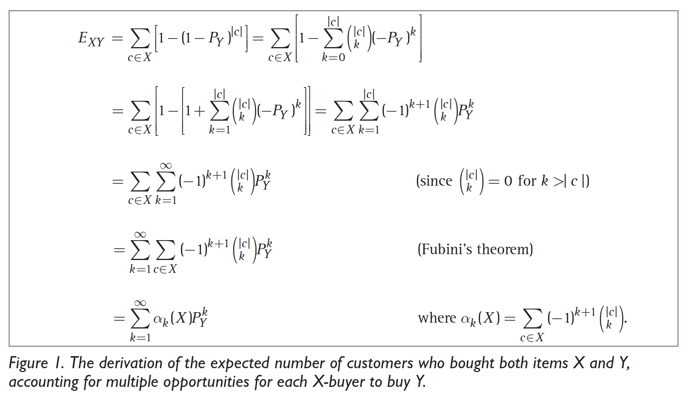

# 召回 Recall

## 1. 传统基于协同过滤的召回

### 1.1 Expectation

We note 

$N_{XY}$: the number of customers who bought both item X and item Y.

$E_{XY}$: the expected num of customers who bought both X and Y.

If we assume X-buyers have the same probability of buying Y as the general population: $P(Y) =\frac{|Y \quad buyers|}{|all\quad buyers|}$. Then $E_{XY} = |X \quad buyers| * P(Y)$ will be the expected number of customers who bought both X and Y.

However, for almost any two items X and Y, customers who bought X will be much more likely to buy Y then the general population.

Sampling a random purchase doesn't give a uniform probability of selecting customers. For heavy buyers, they have much more probability to be selected when we look for all customers who have bought X.

This means we can't ignore who bought X when we try to estimate how many X-buyers we would expect to randomly buy Y.

For a customer who purchased X, we can estimate his probability of buying Y:
$$ 1 - (1-P_Y)^{|c|}$$
Note that $P_Y =\frac{Y \quad purchases}{all \quad purchases}$ is different from $P(Y)$.

$|c|$ represents the number of non-X purchases made by him. Therefore, we can calculate the expected num of customers who bought both X and Y:

$$ E_{XY}=\sum_{c\in X} [1- (1-P_Y)^{|c|}]$$

$N_{XY}-E_{XY}$ gives an estimate of the number of non-random co-ocurrences.

$[N_{XY}-E_{XY}]/E_{XY}$ gives the percent difference from the expected random co-occurrences. 

if we use $N_{XY}-E_{XY}$ as score $S_{XY}$, it will be biased toward popular Y's.

if we use $[N_{XY}-E_{XY}]/E_{XY}$ as score, it will make it too easy for the low-selling items to have high scores.

Therefore, $S_{XY}=[N_{XY}-E_{XY}]/\sqrt{E_{XY}}$ strikes a balance.

### 1.2 Swing

例如用户A和B都购买过商品i，三者构成一个swing，这实际上是三阶交互关系，传统启发式近邻方法只关注用户和物品之间的二阶交互关系。这种方法源自于，如果多个user在点击了i1的同时，都只共同点击i2，那么认为i1和i2是强关联的，这种未知的强关联关系是通过用户行为传递的。另一方面如果两个user pair对之间构成的swing结构越多，则每个结构越弱，在这个pair对上每个节点分到的权重越小。

> 两个用户同时点击商品i和j，如果两个用户共同购买的物品越少，则swing的对应的结构就越强，即物品i与j相似性越高。

$$sim(i,j) = \sum_{u\in U_{ij}} \sum_{v\in U_{ij}} \frac{1}{\alpha + |I_{uv}|}$$

其中，$U_{ij}$表示同时点击过商品i和商品j的用户集，$I_{uv}$表示用户u与用户v共同点击的商品数。

可以看出，如果两用户同时点击i，j，且两用户共同点击商品数量少，则i，j相似度分数越高。

### 1.3 矩阵分解 

SVD++ 就是在 SVD 模型中融入用户对物品的隐式行为。

### 1.4 Wbcos

## 2. Embedding召回

主要分为i2i，u2i，u2u2i三类。

- i2i主要包括： item2vec，node2vec，EGES
- u2i主要包括： DSSM
- u2u2i： 

### 2.1 I2i Embedding 

### 2.1.1 Deep Walk
在图结构上进行随机游走，生成Item序列，然后将这些Item序列作为训练样本输入Skip-Gram进行训练，得到Item的Embedding。从一个节点出发，随机选择它的一个邻接点，再从这个邻接点出发到下一个节点，重复这个步骤然后记录下所经过的所有节点。

### 2.1.2 Node2Vec
参考`embedding.md`

### 2.1.3 EGES

主要思想就是在DeepWalk生成Embedding过程中引入Item的补充信息。
每个补充信息转换为Embedding之后，EGES在对每个Embedding进行加权平均。

### 2.1.4 GNN

### 2.2 U2i Embedding 

### 2.2.1 DSSM

DSSM（Deep Structured Semantic Models ，深度语义模型）是2013年微软发表的一篇论文，本用于语义匹配，后被移植到推荐系统等各个场景，成为经典的双塔模型。

DSSM双塔结构，两侧分别输入user特征和item特征，经过DNN变换后分别产出user向量和item向量。DSSM最大的特点是user侧和item侧是独立的两个子网络，可以离线产出user embedding和item embedding，召回时只需要计算二者的相似度。

### 2.2.2 DNN for Youtube

### 2.3 向量检索
按照某种度量方式，检索出与查询向量相近的K个向量，但由于KNN计算量过大，我们通常只关注近似近邻（Approximate Nearest Neighbor，ANN）问题。

### 2.3.1 基于树的方法

按照某个判定标准，对向量空间进行划分，分到树中各个叶子节点。

### 2.3.2 局部敏感哈希 (LSH)
参考[embedding.md](./embedding.md)

### 2.3.3 基于倒排方法
通过聚类把整个向量空间划分为K个区域，每个区域用一个中心点代替，这样每个向量将自身归入到距离自己最近的中心点对应的倒排。

## 其他非个性化或弱个性化召回

1. hot
2. c2i
3. d2i

